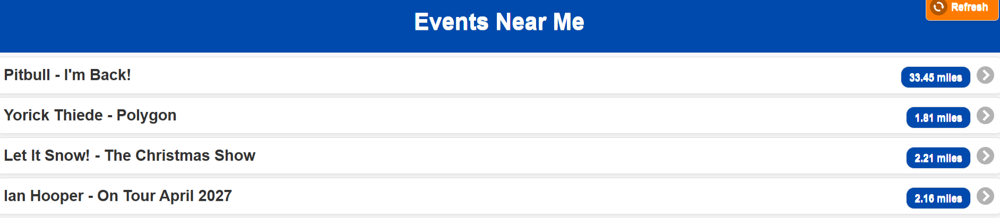

# Nearby Events Finder

A mobile-oriented web application that uses the Ticketmaster Discovery API and browser geolocation to find events near the user's current location.

## Preview



## Features

* Detects the user's current location using browser geolocation
* Finds nearby events using the Ticketmaster Discovery API
* Displays events in a mobile-friendly list
* Shows the distance to each event
* Provides a dedicated event details page
* Displays event date and time
* Displays the event venue
* Provides a direct link to purchase tickets
* Includes a refresh option to search for events again

## Technologies

* HTML5
* CSS3
* JavaScript
* jQuery
* jQuery Mobile
* Ticketmaster Discovery API
* Browser Geolocation API

## How It Works

When the application is opened, it requests permission to access the user's location. The latitude and longitude provided by the browser are then used to search the Ticketmaster Discovery API for nearby events.

The results are displayed in a list together with the distance from the user's location.

Selecting an event opens a details page containing information such as the event name, date, time, venue, and ticket link.

## API Key

The Ticketmaster API key is intentionally not included in this repository.

To run the project, open `script.js` and replace:

```javascript
const TM_API_KEY = "YOUR_TICKETMASTER_API_KEY_HERE";
```

with your own Ticketmaster API key.

## How to Run

1. Clone or download this repository.
2. Add your Ticketmaster API key to `script.js`.
3. Open `index.html` using a local development server.
4. Allow the browser to access your location.
5. Browse the events available near you.
6. Select an event to view its details.

## Project Purpose

This project was developed to practice working with external APIs, browser geolocation, JavaScript event handling, and mobile-oriented web interfaces.

It demonstrates how location-based data can be retrieved and presented through an interactive web application.
